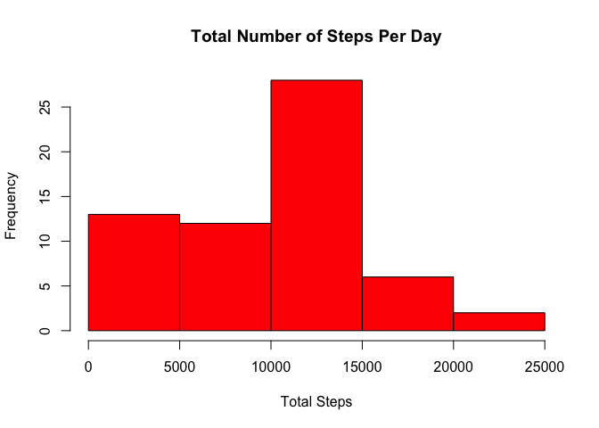
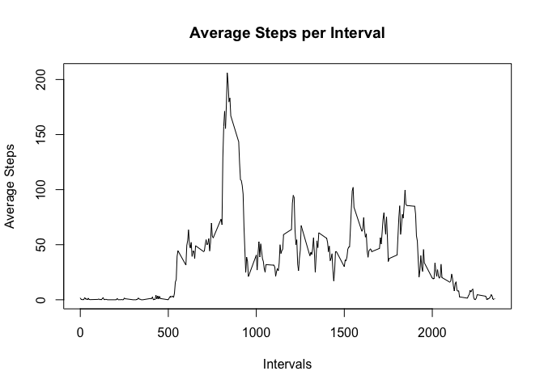
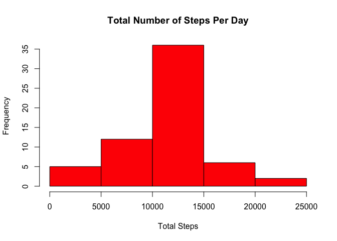
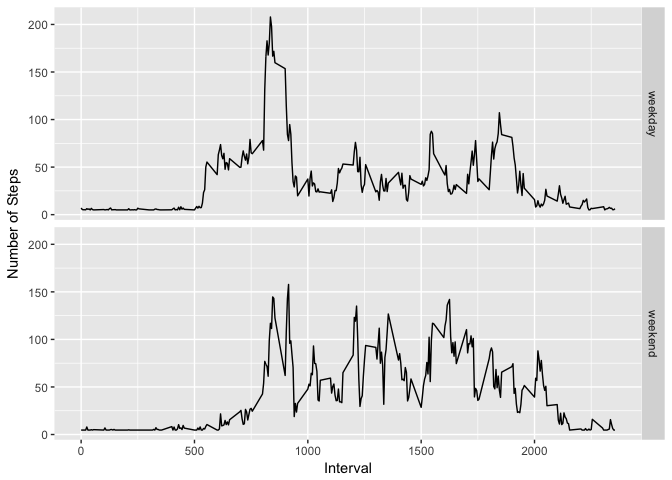

## Loading and preprocessing the data
1. Load the data.

```r
setwd("~/RepData_PeerAssessment1")
if(!file.exists('activity.csv')){
    unzip('activity.zip')
}
data <- read.csv('activity.csv')
```
2. Manipulate the data.

```r
data[,2]<-as.Date(data$date)
```

## What is mean total number of steps taken per day?
1. Prepare a histogram of the total number of steps taken per day.

```r
stepsperday <- with(data,tapply(steps, date, sum, na.rm=TRUE))
hist(stepsperday, col = "red", xlab = "Total Steps", main = "Total Number of Steps Per Day")
```

<!-- -->

2. Calculate the mean and median
Mean:

```r
print(stepsmean <- mean(stepsperday))
```

```
## [1] 9354.23
```
Median:

```r
print(stepsmedian <- median(stepsperday))
```

```
## [1] 10395
```

## What is the average daily activity pattern?
1. Make a time series plot of the 5-minute interval (x-axis) and the average number of steps taken, averaged across all days (y-axis)

```r
averagesteps <-with(data, tapply(steps, interval, mean, na.rm=TRUE))
specialintervals <-unique(data$interval)
newdata <-data.frame(cbind(averagesteps, specialintervals))
plot(newdata$specialintervals, newdata$averagesteps, type = "l", xlab = "Intervals", ylab = "Average Steps", main = "Average Steps per Interval")
```

<!-- -->

2. Which 5-minute interval, on average across all the days in the dataset, contains the maximum number of steps?
+Max steps 5-minute interval:

```r
reference <-which.max(newdata$averagesteps)
print(maxsteps <-newdata[reference, 2])
```

```
## [1] 835
```

## Imputing missing values
1. Calculate and report the total number of missing values in the dataset.
+Total rows with NAs:

```r
print(sum(is.na(data$steps)))
```

```
## [1] 2304
```
2. Fill in missing values using average steps per day across the dataset.

```r
list <-which(is.na(data$steps))
listlength <-length(list)
stepsonaverage <-with(data, tapply(steps, date, mean, na.rm=TRUE))
replace <-mean(stepsonaverage,na.rm = TRUE)
for (i in 1:listlength) {
        data[list[i],1]<-replace
}
```
3. Make a histogram of the new dataset, and report the mean and median.

```r
newstepsperday <-with(data, tapply(steps, date, sum, na.rm=TRUE))
hist(newstepsperday, col = "red", xlab = "Total Steps", main = "Total Number of Steps Per Day")
```

<!-- -->

Mean:

```r
print(newstepsmean <- mean(newstepsperday))
```

```
## [1] 10766.19
```
Median:

```r
print(newstepsmedian <- median(newstepsperday))
```

```
## [1] 10766.19
```
The mean and median steps per day have both increased and are now equal.

## Are there differences in activity patterns between weekdays and weekends?
1. Indicate whether a given date is a weekday or weekend day.

```r
library(dplyr)
```

```
## 
## Attaching package: 'dplyr'
```

```
## The following objects are masked from 'package:stats':
## 
##     filter, lag
```

```
## The following objects are masked from 'package:base':
## 
##     intersect, setdiff, setequal, union
```

```r
library(ggplot2)
```

```r
data$dateType <- ifelse(as.POSIXlt(data$date)$wday %in% c(0,6), 'weekend', 'weekday')
```
2. Make a panel plot containing a time series plot of the 5-minute interval (x-axis) and the average number of steps taken, averaged across all weekday days or weekend days (y-axis).

```r
averagedimputeddata <- aggregate(steps ~ interval + dateType, data=data, mean)
ggplot(averagedimputeddata, aes(interval, steps)) + 
geom_line() + 
facet_grid(dateType ~ .) +
xlab("Interval") + 
ylab("Number of Steps")
```

<!-- -->

Weekends feature more overall activity than weekdays, but weekdays have a greater burst of activity.
